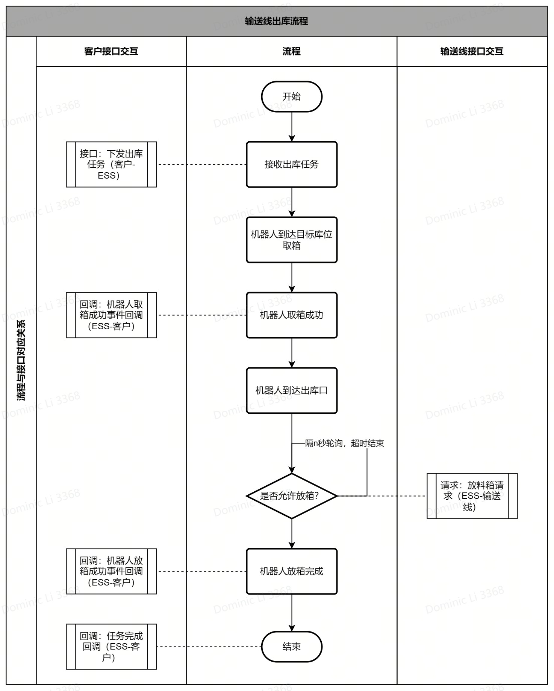
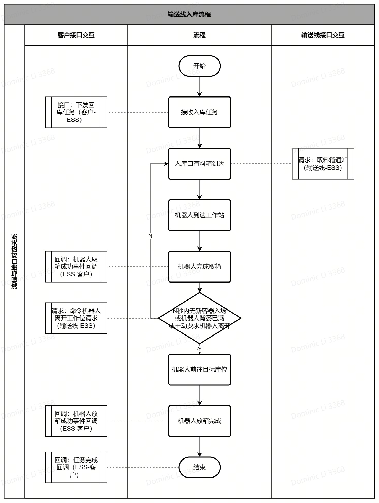
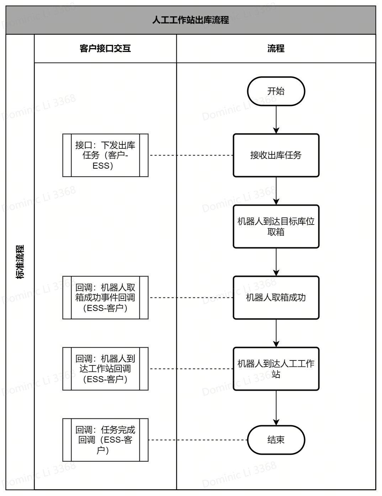
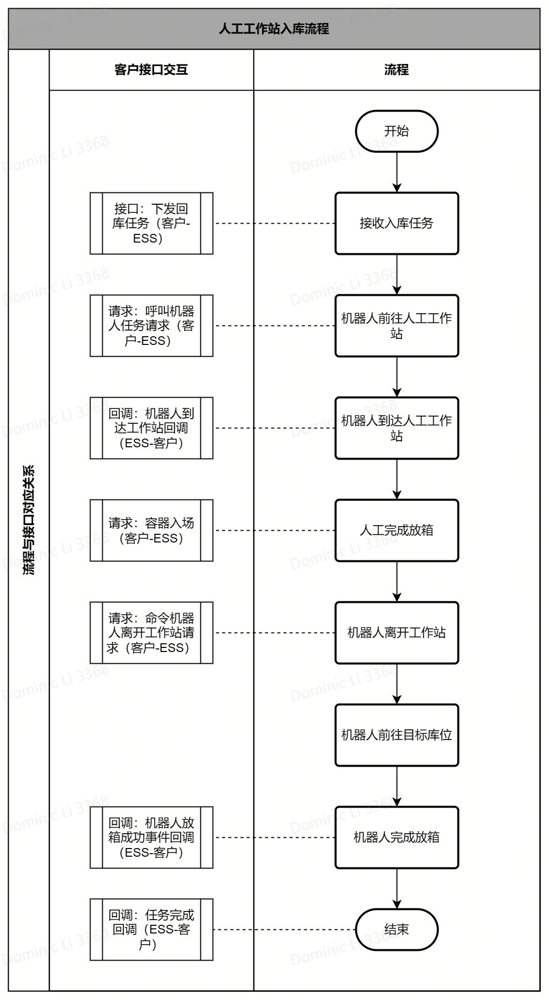
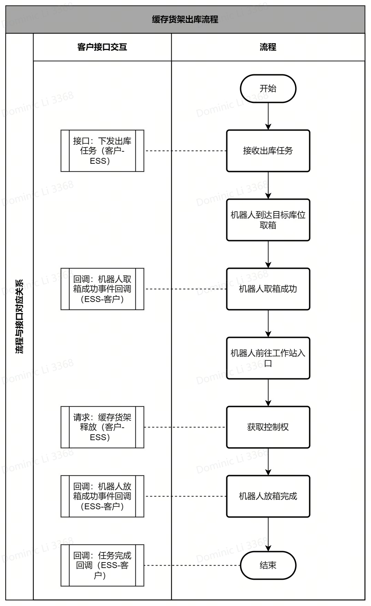
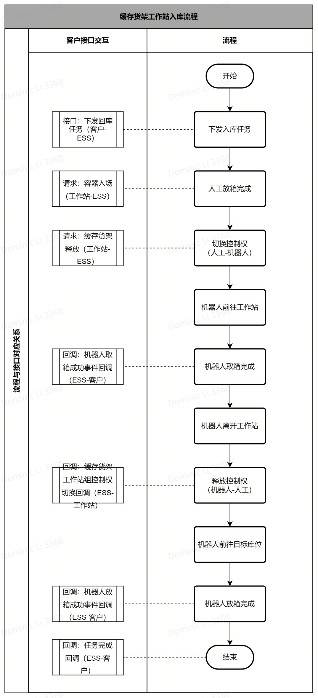
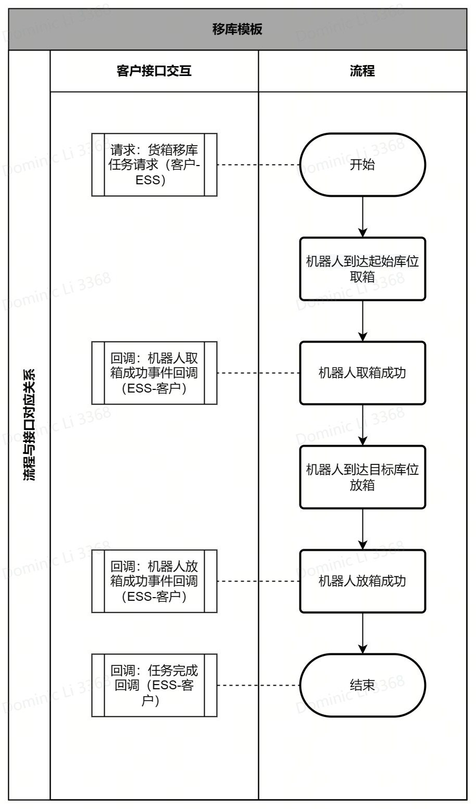
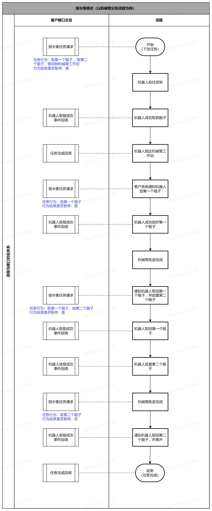

# Table of Contents

# 1. Interface overview
- ESS标准接口统一采用 HTTP 协议，数据交换的格式为 JSON
- 中文使用 URLEncoder.encode("string", "UTF-8")；获取中文字段时, 使用 URLDecoder.decode(“string”, "UTF-8")
# 2. http request header
 ```json
{
  "msgID": 455511
  "sysCode":"IWMS"
  "msgType": "taskRequest"
  "version":"V1.0"
}
```
**当前系统不对header进行校验**
## 2.1 Conveyor outbound接口调用基础模板Wms

说明：将料箱从货架库位搬至输送线工作站

## 2.2 Conveyor inbound
说明：将料箱从输送线工作站搬至货架库位

## 2.3 人工工作站-出库
说明：将料箱从货架库位搬至人工工作站

## 2.4 人工工作站-入库
说明：将料箱从人工工作站搬至货架库位


## 2.5 缓存货架-出库
说明：将料箱从货架库位搬至缓存货架工作站

## 2.6 缓存货架-入库
说明：将料箱从缓存货架工作站搬至货架库位

- 什么是**切换控制权**？
- 什么是**释放控制权**？

## 2.7 Relocation
说明：将料箱从货架库位搬至另一个货架库位


## 2.8 指令集工作模式
说明：系统开放基础的action（支持取、放、移动），客户可以自己组装去用（指令集优先于充电任务）
场景1：机器人在单工作站内多次执行不同或相同动作
场景2：机器人在多工作站之间执行不同或相同动作
场景3：其他任意动作的组合皆可


# 3 任务请求接口
该部分描述与工作站无关的任务请求。

## 3.1 货箱出库任务请求
**接口URL**：POST /ess-api/wms/createWmsOutboundTask

**调用方法：**客户需要ESS进行执行货箱出库任务时，通过此接口将任务下发给ESS

**请求报文：**
```json
{
  "taskGroupCode": "singleConveyorOutside001",
  "groupPriority": 0,
  "businessType": "",
  "tasks": [
    {
      "taskCode": "001",
      "taskPriority": 0,
      "specifiedTrunk": "0: any trunk, 1 - n: trunk number",
      "taskDescribe": {
        "containerCode": "container001",
        "fromLocationCode": "location001",
        "toStationCode": "1,2,3" 
      }
    }
  ]
}
```

**trunk啥意思？**

**响应报文：**
```json
{
    "code": 0, // 0 代表正常，其余代表异常
    "msg": “详情”,
    "data": {返回数据对象，如果需要}
 } 
```
**请求参数说明：**
|               |      |             |    |                                   |
| ------------- | ---- | ----------- | -- | --------------------------------- |
| 字段            | 名称   | 定义          | 必选 | 备注                                |
| taskGroupCode | 任务组号 | string      | N  | 任务组，若不传则系统自动生成                    |
| groupPriority | 组优先级 | int         | N  | 系统会优先执行高优先级组的任务；大于0表示有序，小于等于0表示无序 |
| businessType  | 业务类型 | string      | N  |                                   |
| tasks         | 任务   | list\<task> | Y  | 任务列表                              |

**Task**
|                |        |                       |    |                                   |
| -------------- | ------ | --------------------- | -- | --------------------------------- |
| 字段             | 名称     | 定义                    | 必选 | 备注                                |
| taskCode       | 任务号    | string                | Y  | 业务任务号。系统会根据工作站类型去使用不同的控制器去管理任务的运行 |
| taskPriority   | 任务优先级  | int                   | N  | 大于0表示有序，小于等于0表示无序                 |
| deadline       | 截单时间   | long                  | N  | 时间戳，ms。若临近截单时间N（N可配置），则订单优先执行     |
| taskDescribe   | 任务描述   | object\<taskDescribe> | Y  | 描述出库所需要的参数                        |
| specifiedTrunk | 指定料箱位置 | string                | N  | 料箱出库时指定料箱放到哪个背篓（0为不指定，1-n指定背篓层数）  |


**TaskDescribe:**
|                     |          |        |    |                                                                                                                              |
| ------------------- | -------- | ------ | -- | ---------------------------------------------------------------------------------------------------------------------------- |
| 字段                   | 名称       | 定义     | 必选 | 备注                                                                                                                           |
| containerCode       | 货箱编码     | string | N  | 容器和工作位二选一，优先取容器code                                                                                                          |
| fromLocationCode    | 起始工作位    | string | N  |                                                                                                                              |
| //todotoStationType | 目标工作站类型  | string | N  | 支持以下类型的工作站，系统选择该类型下的一个可用工作站输送线工作站CONVEYOR\_STATION人工工作站LABOR\_STATION缓存货架工作站RACK\_BUFFER\_STATION工作站类型和工作站编码二选一，均填写，以工作站编码为准 |
| toStationCode       | 目标工作站编码  | string | Y  | 多个目的地用逗号隔开                                                                                                                   |
| toLocationCode      | 目标工作站工作位 | string | N  |                                                                                                                              |
| containerFace       | 目标容器朝向   | string | N  | A:0 B:90 C:180 D:270                                                                                                         |

## 3.2 货箱搬运任务请求
**接口URL**：POST /ess-api/wms/createWmsTmsTask

**调用方法：**客户需要ESS进行执行货箱搬运任务时，通过此接口将任务下发给ESS

**请求报文：**
```json
{
  "taskGroupCode": "singleConveyorOutside001",
  "groupPriority": 0,
  "businessType": "",
  "tasks": [
    {
      "taskCode": "001",
      "taskPriority": 0,
      "taskDescribe": {
        "containerCode": "container001",
        "fromLocationCode": "location001",
        "toStationCode": "1" 
      }
    }
  ]
}
```

**响应报文：**
```json
{
    "code": 0, // 0 代表正常，其余代表异常
    "msg": “详情”,
    "data": {返回数据对象，如果需要}
 } 
```
**请求参数说明**
|               |      |             |    |                 |
| ------------- | ---- | ----------- | -- | --------------- |
| 字段            | 名称   | 定义          | 必选 | 备注              |
| taskGroupCode | 任务组号 | string      | N  | 任务组，若不传则系统自动生成  |
| groupPriority | 组优先级 | int         | N  | 系统会优先执行高优先级组的任务 |
| businessType  | 业务类型 | string      | N  | tms\_task       |
| tasks         | 任务   | list\<task> | Y  | 任务列表            |

**Task**
|                |        |        |    |                                   |
| -------------- | ------ | ------ | -- | --------------------------------- |
| 字段             | 名称     | 定义     | 必选 | 备注                                |
| taskCode       | 任务号    | string | Y  | 业务任务号。系统会根据工作站类型去使用不同的控制器去管理任务的运行 |
| taskPriority   | 任务优先级  | int    | N  |                                   |
| deadline       | 截单时间   | long   | N  | 时间戳，ms。若临近截单时间N（N可配置），则订单优先执行     |
| specifiedTrunk | 指定料箱位置 | string | N  | 料箱出库时指定料箱放到哪个背篓（0为不指定，1-n指定背篓层数）  |


**Task:TaskDescribe**
|                  |          |        |    |                              |
| ---------------- | -------- | ------ | -- | ---------------------------- |
| 段                | 名称       | 定义     | 必选 | 备注                           |
| containerCode    | 货箱编码     | string | N  | 容器和工作位二选一，优先取容器code          |
| fromLocationCode | 起始工作位    | string | N  |                              |
| toStationCode    | 目标工作站编码  | string | N  | 目标工作站编码 和目标工作站工作位 二选一，优先取工作位 |
| toLocationCode   | 目标工作站工作位 | string | N  |                              |
| containerFace    | 目标容器面向   | string | N  | A:0 B:90 C:180 D:270         |

**相应参数说明：**
|      |            |                     |    |                   |
| ---- | ---------- | ------------------- | -- | ----------------- |
| 字段   | 名称         | 定义                  | 必选 | 备注                |
| data | 任务创建请求响应结果 | map\<string,string> | Y  | Key 任务编码Value 状态码 |

**Value enum**
|                                          |             |    |
| ---------------------------------------- | ----------- | -- |
| 字段                                       | 名称          | 备注 |
| OK                                       | 成功          |    |
| *TASK\_TEMPLATE\_NOT\_EXIST*             | 任务模板不存在     |    |
| *ACTION\_PARAM\_ARRAY\_SIZE\_NOT\_MATCH* | 行为参数数组大小不匹配 |    |
| *UNKNOWN\_DESTINATION\_CODE*             | 目的地不存在      |    |
| *NO\_SPECIFIED\_ROBOT*                   | 未指定机器人      |    |
| *NO\_SPECIFIED\_CONTAINER*               | 未指定容器       |    |
| *NO\_AVAILABLE\_ROBOT*                   | 没有可用的机器人    |    |
| *TASK\_ALREADY\_EXIST*                   | 任务已经存在      |    |
| *CONTAINER\_PUTAWAY\_PROCESSING*         | 容器上架处理中     |    |
| *CODE\_ALREADY\_EXIST*                   | 编码已经存在      |    |
| *NO\_SPECIFIED\_LOCATION*                | 未指定库位       |    |

## 3.3 货箱移库任务请求

**调用方法：**客户需要ESS进行执行容器的移库任务时使用此接口

**接口URL**：POST /ess-api/wms/createWmsRelocationTask

**请求报文：**

```json
{
  "taskGroupCode": "relocation001",
  "groupPriority": 0,
  "tasks": [
    {
      "taskTemplateCode": "TOTE_RELOCATION",
      "taskCode": "001",
      "taskPriority": 0,
      "taskDescribe": {
        "containerCode": "container001",
        "fromLocationCode": "HAI-001-002-01",
        "toLocationCode": "HAI-001-001-01",
        "toStationCode": "LA_SHELF_STORAGE"
      }
    }
  ]
}
```
toLocationCode 和 toStationCode 应该是只有一个才能生效，若两个同时存在，什么异常？

答：没异常，优先取库位编码执行移库任务！


**响应报文：**

空！等着报ERROR code

**请求参数说明**
|               |      |             |    |                 |
| ------------- | ---- | ----------- | -- | --------------- |
| 字段            | 名称   | 定义          | 必选 | 备注              |
| taskGroupCode | 任务组号 | string      | N  | 任务组，若不传则系统自动生成  |
| groupPriority | 组优先级 | int         | N  | 系统会优先执行高优先级组的任务 |
| tasks         | 任务   | list\<task> | Y  | 任务列表            |

**Task**

|                  |       |                       |    |                  |
| ---------------- | ----- | --------------------- | -- | ---------------- |
| 字段               | 名称    | 定义                    | 必选 | 备注               |
| taskTemplateCode | 任务模板  | string                | Y  | TOTE\_RELOCATION |
| taskPriority     | 任务优先级 | int                   | N  |                  |
| taskCode         | 任务号   | string                | Y  | 业务任务号            |
| taskDescribe     | 任务描述  | object\<taskDescribe> | Y  | 描述模板需要的参数        |


**task：taskDescribe**

|                  |        |        |    |                           |
| ---------------- | ------ | ------ | -- | ------------------------- |
| 字段               | 名称     | 定义     | 必选 | 备注                        |
| containerCode    | 货箱编码   | string | N  | 容器和工作位二选一，优先取容器code       |
| fromLocationCode | 起始库位编码 | string | N  |                           |
| toLocationCode   | 目标库位编码 | string | N  | 目标库位编码和工作站编码二选一，优先取目标**库位编码** |
| toStationCode    | 目标工作站  | string | N  |                           |

**响应参数说明：**

**状态码**
|                                          |             |    |
| ---------------------------------------- | ----------- | -- |
| 字段                                       | 名称          | 备注 |
| OK                                       |             |    |
| *TASK\_TEMPLATE\_NOT\_EXIST*             | 任务模板不存在     |    |
| *ACTION\_PARAM\_ARRAY\_SIZE\_NOT\_MATCH* | 行为参数数组大小不匹配 |    |
| *UNKNOWN\_DESTINATION\_CODE*             | 目的地不存在      |    |
| *NO\_SPECIFIED\_ROBOT*                   | 未指定机器人      |    |
| *NO\_SPECIFIED\_CONTAINER*               | 未指定容器       |    |
| *NO\_AVAILABLE\_ROBOT*                   | 没有可用的机器人    |    |
| *TASK\_ALREADY\_EXIST*                   | 任务已经存在      |    |
| *CONTAINER\_PUTAWAY\_PROCESSING*         | 容器上架处理中     |    |
| *CODE\_ALREADY\_EXIST*                   | 编码已经存在      |    |
| *NO\_SPECIFIED\_LOCATION*                | 未指定库位       |    |


## 3.4 货箱回库任务请求
**接口URL**：POST /ess-api/wms/createWmsInboundTask

**调用方法：**客户需要ESS进行执行货箱回库任务时，通过此接口将任务下发给ESS

**请求报文：**
```json
{
  "taskGroupCode": "singleConveyorInside001",
  "groupPriority": 0,
  "tasks": [
    {
      "taskTemplateCode": "TOTE_INBOUND",
      "taskCode": "001",
      "taskPriority": 0,
      "taskDescribe": {
      "containerCode": "container001",
      "locationCode":"HAI-01-01-11",
      "fromLocationCode":"CS-01-01-11"
      }
    }
  ]
}
```
**响应报文：**
```json
{
    "code": 0, // 0 代表正常，其余代表异常
    "msg": “详情”,
    "data": {返回数据对象，如果需要}
 } 
```

**请求参数说明：**

|               |      |             |    |                 |
| ------------- | ---- | ----------- | -- | --------------- |
| 字段            | 名称   | 定义          | 必选 | 备注              |
| taskGroupCode | 任务组号 | string      | N  | 任务组，若不传则系统自动生成  |
| groupPriority | 组优先级 | int         | N  | 系统会优先执行高优先级组的任务 |
| tasks         | 任务   | list\<task> | Y  | 任务列表            |


**task**

|                  |      |                       |    |               |
| ---------------- | ---- | --------------------- | -- | ------------- |
| 字段               | 名称   | 定义                    | 必选 | 备注            |
| taskTemplateCode | 任务模板 | string                | Y  | TOTE\_INBOUND |
| taskCode         | 任务号  | string                | Y  | 业务任务号         |
| taskDescribe     | 任务描述 | object\<taskDescribe> | Y  | 描述入库所需要的参数    |


**task：taskDescribe**
|                  |      |        |    |                       |
| ---------------- | ---- | ------ | -- | --------------------- |
| 字段               | 名称   | 定义     | 必选 | 备注                    |
| containerCode    | 货箱编码 | string | Y  |                       |
| locationCode     | 目标库位 | string | N  | 若没有填写，则系统会随机找一个允许放的库位 |
| fromLocationCode | 源库位  | string | N  | 若填写，系统会校验箱子和库位是否匹配    |


## 3.5 货箱盘点任务请求
**接口URL**：POST /ess-api/wms/createWmsCheckTask

**调用方法：**客户需要ESS进行执行货箱盘点任务时，通过此接口将任务下发给ESS

**请求报文：**
```json
{
  "taskGroupCode": "singleConveyorInside001",
  "groupPriority": 0,
  "tasks": [
    {
      "taskTemplateCode": "TOTE_CHECK",
      "taskCode": "001",
      "taskPriority": 0,
      "taskDescribe": {
          "locationCode": "location001"
      }
    }
  ]
}
```
其中：`taskTemplateCode`取值扫描用TOTE_SCAN；称重或rfid盘点用TOTE_CHECK；
**响应报文：**
```json
{
    "code": 0, // 0 代表正常，其余代表异常
    "msg": “详情”,
    "data": {返回数据对象，如果需要}
 } 
```

**请求参数说明：**

|               |      |             |    |                 |
| ------------- | ---- | ----------- | -- | --------------- |
| 字段            | 名称   | 定义          | 必选 | 备注              |
| taskGroupCode | 任务组号 | string      | N  | 任务组，若不传则系统自动生成  |
| groupPriority | 组优先级 | int         | N  | 系统会优先执行高优先级组的任务 |
| tasks         | 任务   | list\<task> | Y  | 任务列表            |


**task**
|                  |      |                       |    |              |
| ---------------- | ---- | --------------------- | -- | ------------ |
| 字段               | 名称   | 定义                    | 必选 | 备注           |
| taskTemplateCode | 任务模板 | string                | Y  | *按项目配置*      |
| taskCode         | 任务号  | string                | Y  | 业务任务号        |
| taskDescribe     | 任务描述 | object\<taskDescribe> | Y  | 描述盘点任务所需要的参数 |


**task：taskDescribe**
|               |      |        |    |      |
| ------------- | ---- | ------ | -- | ---- |
| 字段            | 名称   | 定义     | 必选 | 备注   |
| containerCode | 货箱编码 | string | N  |      |
| locationCode  | 目标库位 | string | Y  | 盘点库位 |

**响应参数说明：**
|      |        |        |    |                   |
| ---- | ------ | ------ | -- | ----------------- |
| 字段   | 名称     | 定义     | 必选 | 备注                |
| code | 响应状态码  | int    | Y  | 成功：0失败：其他值        |
| msg  | 返回信息说明 | string | Y  | 成功：success失败：提示信息 |
| data | 返回的数据  | object | N  | 返回数据对象，如果需要       |


## 3.6 任务挂起恢复请求
**调用方法：**

**请求报文：**

POST /ess-api/wms/resumeSysTask

```json
{
   "sysTaskCodes": [
    "1:load-1705147424758043904"
  ]
}
```
**响应报文：**

```json
{
    "code": 0, // 0 代表正常，其余代表异常
    "msg": “详情”,
    "data": {返回数据对象，如果需要}
 } 
```
**请求参数说明：**
|              |        |               |    |                 |
| ------------ | ------ | ------------- | -- | --------------- |
| 字段           | 名称     | 定义            | 必选 | 备注              |
| sysTaskCodes | 系统任务编号 | list\<string> | Y  | 任务必须为挂起状态才能将其继续 |

**响应参数说明：**


## 3.7 任务取消请求
**接口URL**：POST /ess-api/wms/cancelWmsTask

**调用方法:** 客户需要取消业务任务时，使用此接口进行取消

**请求报文：**
```json
{
  "taskCodes": [
    "taskCode001","taskCode002"
  ]
}
```
**响应报文：**
```json
{
    "code": 0, // 0 代表正常，其余代表异常
    "msg": “详情”,
    "data": {返回数据对象，如果需要}
 } 
```
**请求参数说明：**
|           |      |               |    |               |
| --------- | ---- | ------------- | -- | ------------- |
| 字段        | 名称   | 定义            | 必选 | 备注            |
| taskCodes | 任务编码 | list\<string> | Y  | 业务任务和系统任务都可取消 |


**响应参数说明：**


## 3.8 任务完成请求
**接口URL**：POST /ess-api/wms/finishWmsTask

**调用方法：**客户需要完成业务任务时，使用此接口进行完成

**请求报文：**
```json
{
  "taskCodes": [
    "taskCode001","taskCode002"
  ]
}
```
**响应报文：**
```json
{
  "code": 0,
  "msg": "success",
  "data": [
    "taskCode001"  //返回成功的任务编码，失败的原因一般是容器在机器人身上
  ]
}
```

**请求参数说明：**
|           |      |               |    |        |
| --------- | ---- | ------------- | -- | ------ |
| 字段        | 名称   | 定义            | 必选 | 备注     |
| taskCodes | 任务编码 | list\<string> | Y  | 业务任务编码 |

**响应参数说明：**


## 3.9 任务优先级

**接口URL**：POST /ess-api/wms/updateTaskPriority

**调用方法：**已下发未完成的任务，需要修改优先级时可调用该接口

**请求报文：**

```json
{
    "updateTaskPrioritys": [
        {
            "type": "UPDATE_GROUP_PRIORITY,UPDATE_TASK_PRIORITY", 
            "code": "taskCode001", 
            "priority": 5 
        }
    ]
}
```

**响应报文：**
```json
{
    "code": 0, // 0 代表接口正常，其余代表接口异常
    "msg": “详情”,
    "data": {
        //  只返回修改成功的任务的code
        "code-001": "OK"//key:对应的code，value:"OK"
    }
 } 
```

**请求参数说明：**


|                     |       |      |    |       |
| ------------------- | ----- | ---- | -- | ----- |
| 字段                  | 名称    | 定义   | 必选 | 备注    |
| updateTaskPrioritys | 调整优先级 | list | Y  | 优先级列表 |

|          |     |        |    |                                                                |
| -------- | --- | ------ | -- | -------------------------------------------------------------- |
| 字段       | 名称  | 定义     | 必选 | 备注                                                             |
| type     | 类型  | string | Y  | UPDATE\_GROUP\_PRIORITY =调整组优先级UPDATE\_TASK\_PRIORITY =调整任务优先级 |
| code     | 编码  | string | Y  | 任务编码                                                           |
| priority | 优先级 | int    | Y  | 调整后的优先级，大于等于0的整数                                               |

**响应参数说明：**


## 3.10 任务目的地更新请求
**接口URL**：POST /ess-api/wms/updateTmsTaskDestination

**调用方法：更新任务目的地，只有任务未分配才能更新。（只限于更新搬运任务目的地）**

**请求报文：**
```json
{
  "tasks": [
    {
      "taskCode": "taskCode001",
      "taskDescribe": {
        "toStationCode": "W-1",
        "toLocationCode": "HAI23-011-09"
      }
    }
  ]
}
```
**响应报文：**
```json
{
    "code": 0, // 0 代表正常，其余代表异常
    "msg": “详情”,
    "data": {返回数据对象，如果需要} 
 } 
```

**请求参数说明：**
|       |    |             |    |        |
| ----- | -- | ----------- | -- | ------ |
| 段     | 名称 | 定义          | 必选 | 备注     |
| tasks | 任务 | list\<task> | Y  | 更新任务列表 |

**task**
|              |      |                       |    |              |
| ------------ | ---- | --------------------- | -- | ------------ |
| 字段           | 名称   | 定义                    | 必选 | 备注           |
| taskCode     | 任务号  | string                | Y  | 业务任务号        |
| taskDescribe | 任务描述 | object\<taskDescribe> | Y  | 描述更新任务所需要的参数 |

**task：taskDescribe**
|                |       |        |    |          |
| -------------- | ----- | ------ | -- | -------- |
| 字段             | 名称    | 定义     | 必选 | 备注       |
| toStationCode  | 目标工作站 | string | N  | 和工作位选一填写 |
| toLocationCode | 目标工作位 | string | N  |          |

**响应参数说明：**

## 3.11 工作站容器转面请求
**调用方法：**

当容器需要转面操作时，可以调用该接口。

**接口URL**：POST /ess-api/station/changeContainerFace

**回调报文：**
```json
{
  "containerCode": "container1",
  "containerFace": "A" // A->0  B->90  C->180  D->270
}
```

**响应报文：**
```json
{
    "code": 0, // 0 代表正常，其余代表异常
    "msg": “详情”,
    "data": {返回数据对象，如果需要}
 } 
```

**请求参数说明：**


|               |      |        |    |                          |
| ------------- | ---- | ------ | -- | ------------------------ |
| 字段            | 名称   | 定义     | 必选 | 备注                       |
| containerCode | 容器编号 | string | Y  |                          |
| containerFace | 容器朝向 | string | Y  | A->0 B->90 C->180 D->270 |

## 3.12 呼叫机器人任务请求任务

**接口URL**：POST /ess-api/wms/createWmsCallTask

**调用方法：**呼叫机器人来工作站，适用不同的工作站类型

**请求报文：**

```json
{
  "taskGroupCode": "callTask001",
  "groupPriority": 0,
  "tasks": [
    {
      "taskTemplateCode": "CALL_ROBOT",
      "taskCode": "001",
      "taskPriority": 0,
      "taskDescribe": {
        "robotCode": "kubot-1",
        "toStationCode": "1"
      }
    }
  ]
}
```
**响应报文：**
```json
{
    "code": 0, // 0 代表正常，其余代表异常
    "msg": “详情”,
    "data": {返回数据对象，如果需要}
 }
```

**请求参数说明：**

|               |      |             |    |                 |
| ------------- | ---- | ----------- | -- | --------------- |
| 字段            | 名称   | 定义          | 必选 | 备注              |
| taskGroupCode | 任务组号 | string      | N  | 任务组，若不传则系统自动生成  |
| groupPriority | 组优先级 | int         | N  | 系统会优先执行高优先级组的任务 |
| tasks         | 任务   | list\<task> | Y  | 任务列表            |

**task**

|                  |       |                       |    |                    |
| ---------------- | ----- | --------------------- | -- | ------------------ |
| 字段               | 名称    | 定义                    | 必选 | 备注                 |
| taskTemplateCode | 任务模板  | string                | Y  | CALL\_ROBOT呼叫机器人模板 |
| taskPriority     | 任务优先级 | int                   | N  |                    |
| taskCode         | 任务号   | string                | Y  | 业务任务号              |
| taskDescribe     | 任务描述  | object\<taskDescribe> | Y  | 描述任务模板需要的参数        |


**task：taskDescribe**

|                |       |        |    |                                               |
| -------------- | ----- | ------ | -- | --------------------------------------------- |
| 字段             | 名称    | 定义     | 必选 | 备注                                            |
| robotCode      | 机器人编码 | string | N  | 若不指定机器人编码，则系统会安排满足对应一个机器人                     |
| toStationCode  | 目标工作站 | string | N  | 目标工作站和工作位可以任选一,工作位优先，若不指定工作位，系统会根据工作站作业逻辑进行分配 |
| toLocationCode | 工作位编码 | string | N  |                                               |


**响应参数说明：**


## 3.13 指令集任务请求
**接口URL**：POST /ess-api/wms/createActionTask

**调用方法：** 客户按照系统支持的指令集下发对应任务，自行按步骤进行任务，相当于直接给机器人下发一个队列，客户再针对这个队列进行更新和管理。整个指令是否能连贯执行需要客户自行保证。

- 该模式下，若机器人没有任务了，则机器人会自动释放，若背有货箱，则会自动还箱
- 任务一旦执行不下去会挂起不会失败
- 机器人接收任务后会转为人工模式，执行结束后会恢复自动模式

**请求报文：**

```json
  {
      "taskGroupCode": "210712",
      "tasks": [
        {
          "taskAction": "load",
          "taskCode": "0708-01-01",
          "isFinallyPaused": false,
          "containerCode": "bin4-05-08"
        },
    {
      "taskAction": "load",
      "taskCode": "0708-01-02",
      "isFinallyPaused": false,
      "containerCode": "bin4-05-09"
    },
    {
      "taskAction": "unload",
      "taskCode": "0708-01-03",
      "isFinallyPaused": true,
      "containerCode": "bin4-05-08",
      "locationCode": "LT_CONVEYOR_INOUT:POINT:3920:1280"
    },
     {
      "taskAction": "load",
      "taskCode": "0708-01-04",
      "isFinallyPaused": false,
      "containerCode": "bin4-05-08"
    },
    {
      "taskAction": "unload",
      "taskCode": "0708-01-05",
      "isFinallyPaused": true,
      "containerCode": "bin4-05-09",
      "locationCode": "LT_CONVEYOR_INOUT:POINT:3920:1280"
    },
     {
      "taskAction": "load",
      "taskCode": "0708-01-06",
      "isFinallyPaused": false,
      "containerCode": "bin4-05-09"
    },
     {
      "taskAction": "unload",
      "taskCode": "0708-01-07",
      "isFinallyPaused": false,
      "containerCode": "bin4-05-08",
      "locationCode": "4-05-08"
    },
    {
      "taskAction": "unload",
      "taskCode": "0708-01-08",
      "isFinallyPaused": false,
      "containerCode": "bin4-05-09",
      "locationCode": "4-05-09"
    },
    {
      "taskAction": "nop",
      "taskCode": "0708-01-09",
      "isFinallyPaused": false,
      "pointCode": "POINT:3920:1280",
      "robotTheta": 90
    },
    {
        "taskAction": "internal-load", // 内部取箱（背篓到货叉）
        "taskCode": "001",
        "isFinallyPaused": true,
        "containerCode": "bin0209100704-200",
        "isStayStill": true,//内部取箱必填，代表移动完成，原地直接执行内部取箱
        "specifiedTrunk": 2 // 从第2层背篓取箱到货叉
    },
    {
        "taskAction": "internal-unload", // 内部放箱（货叉到背篓）
        "taskCode": "002",
        "isFinallyPaused": true,
        "containerCode": "bin0209100704-200",
        "isStayStill": true, //内部放箱必填，代表移动完成，原地直接执行内部放箱
        "specifiedTrunk": 7 // 将货叉上的容器放到第7层背篓
    },
    {
        "taskAction": "nop",
        "taskCode": "003",
        "isFinallyPaused": true,
        "pointCode": "POINT:3920:1280",//调整货叉高度时，要填写机器人当前位置，填写其他点位也不会移动，直接原地完成货叉升降
        "robotTheta": 90,
        "isStayStill": true, //调整货叉高度必填，代表移动完成，原地直接执行货叉高度升降
        "specifiedForkHeight": 1200 // 调整货叉高度
    }，
    {
        "taskAction": "rfid",
        "taskCode": "t5",
        "isFinallyPaused": false,
        "containerCode": "containerCode1",
        "locationCode":"HAI-001-006-05"
     },
     {
        "taskAction": "weigh",
        "taskCode": "t6",
        "isFinallyPaused": false,
        "containerCode": "containerCode1",
        "pointCode": "POINT:3920:1280",
        "robotTheta": 90
     }
  ],
  "robotCode": "kubot-2"
}
```

**响应报文：**
```json
{
    "code": 0, // 0 代表正常，其余代表异常
    "msg": “详情”,
    "data": {返回数据对象，如果需要}
 } 
```
**请求参数说明：**
|               |       |             |    |                                                                    |
| ------------- | ----- | ----------- | -- | ------------------------------------------------------------------ |
| 字段            | 名称    | 定义          | 必选 | 备注                                                                 |
| taskGroupCode | 任务组号  | string      | N  | 任务组，若不传则系统自动生成，一个任务组系统认为是一个队列，且是对一个机器人进行服务追加任务时，此组号和机器人编码必须和在执行的一致 |
| tasks         | 任务    | list\<task> | Y  | 任务列表                                                               |
| robotCode     | 机器人编码 | string      | Y  | 当前必须指定一个执行机器人                                                      |


**task**

|                     |          |        |    |                                                                                                                                                                     |
| ------------------- | -------- | ------ | -- | ------------------------------------------------------------------------------------------------------------------------------------------------------------------- |
| 字段                  | 名称       | 定义     | 必选 | 备注                                                                                                                                                                  |
| taskAction          | 任务行为     | string | Y  | load 取货箱，自带移动unload 放货箱，自带移动nop 纯移动（包括货叉升降）scan 扫码，自带移动internal-unload 内部放（货叉-背篓）internal-load 内部取 （背篓-货叉）rfid rfid盘点，使用kubot配置中的盘点背篓盘点weigh 称重盘点，使用kubot配置中的盘点背篓盘点 |
| taskCode            | 任务号      | string | Y  | 业务任务号，请注意每次必须不一样                                                                                                                                                    |
| isFinallyPaused     | 行为结束是否暂停 | bool   | N  | 默认0。指任务结束后不暂停，机器人被释放。1，指任务结束后会暂停，直至使用暂停恢复接口继续执行后续任务。行为取消不再生效，成功会生效。暂停机器人后，可继续往机器人任务列表追加任务，再恢复后机器人会继续执行后续任务。                                                         |
| containerCode       | 容器编码     | string | N  | LOAD时容器和工作位二选一UNLOAD、internal-unload、internal-load 时必填                                                                                                              |
| locationCode        | 工作位编码    | string | N  | LOAD时容器和工作位二选一UNLOAD时必填NOP模式若填写，则系统会寻找该工作位对应的工作点进行停靠，若工作位和节点都填写，则优先工作位rifd/weigh 时需指定盘点位置，可指定locationCode或者pointCode和robotTheta，优先取pointCode                        |
| pointCode           | 节点编码     | string | N  | 仅NOP、rfid、weigh 可用                                                                                                                                                  |
| robotTheta          | 机器人姿态角度  | int    | N  | 仅NOP、rfid、weigh 可用0, 90, 180 ,270                                                                                                                                   |
| specifiedTrunk      | 机器人背篓层数  | int    | N  | 0为不指定，1-n指定背篓层数（1代表背篓第一层）                                                                                                                                           |
| specifiedForkHeight | 机器人货叉高度  | int    | N  | 机器人货叉升降的高度，需原地完成                                                                                                                                                    |
| isStayStill         | 移动完成     | bool   | N  | 直接原地移动完成                                                                                                                                                            |


**响应参数说明：**

## 3.14 机器人暂停恢复工作请求

**接口URL**：POST /ess-api/wms/resumeRobot

**调用方法：**当机器人被暂停时，可使用此接口使机器人继续执行任务

**请求报文：**
```json
{
  "robotCode": "kubot-2"
}
```
**响应报文：**

```json
{
    "code": 0, // 0 代表正常，其余代表异常
    "msg": “详情”,
    "data": {返回数据对象，如果需要}
 } 

```

**请求参数说明：**
|           |       |        |    |                                  |
| --------- | ----- | ------ | -- | -------------------------------- |
| 字段        | 名称    | 定义     | 必选 | 备注                               |
| taskCode  | 任务编码  | string | N  | 指定要完成的任务号，任务和机器人二选一填写，若均填写，以任务为准 |
| robotCode | 机器人编码 | string | N  | 使在执行等待的机器人的对应当前任务完成              |

**响应参数说明：**
