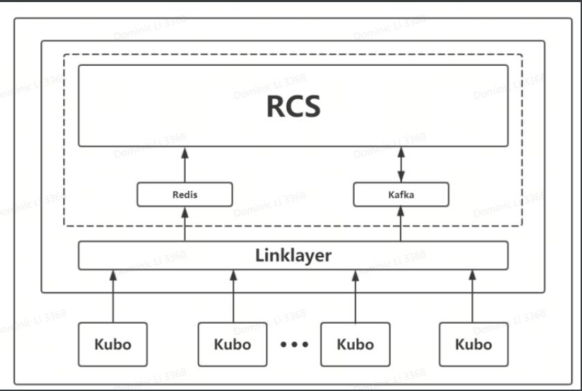

# 1. 接口
## 1.1 概述

如框架图所示,虚线框内包含接入服务(Linklayer)、消息中间件(Redis/Kafka)、调度系统(RCS),运行于服
务器环境中。机器人通过WIFI/4G/5G等无线网络设施与Linklayer进行通信,Linklayer可以同时接入多个机器人。
RCS通过 Linklayer获取机器人状态和控制机器人,RCS与Linklayer通过redis和kafka进行通信,RCS可以是海
柔提供的也可以是第三方集成商的。通信消息格式及流程遵循本文档定义。

机器人需要配置Linklayer所在服务器IP地址,同时机器人需要配置自身robotld用于识别以及配置自身IP。
## 1.2 数据接口
机器人状态信息周期上报到redis(端口6379),对应数据的key为:kubot_robotld

调度系统通过kafka(端口9092)发送指令给机器人,对应topic为:11

机器人回复给调度系统下发指令的响应通过kafka,对应topic为:ss

## 1.3数据格式
机器人和调度系统之间交互的数据采用json格式。


# 2. 协议
交互以Report,Request/Resonse形式进行。机器人周期(200ms)Report状态信息到Redis,RCS从Redis中获取机器人的实时状态信息,状态信息由机器人单方向上报,RCS无需响应。RCS通过Kafka的IItopic下发送Request指令给机器人,机器人接收到指令,执行成功或失败后回复响应LL2RCS_RESP到Kafka的sstopic。如果发送指令后机器人长时间没有响应,RCS需要根据具体情况自行决定重重发指令或请求人工介入。

## 2.1 状态信息上报
```json
{
"seqNum": uint64                            // 上报信息序列号，每发送一条递增1
"robotId": string                               // 机器人ID，全局唯一

"robotState": int                               // 机器人状态，定义：RobotState
"errorState": []                                 // 机器人故障信息，定义： ErrorState
"mapPosition" : PositionXYT           // 当前位置， 定义： PositionXYT
"motionSpeed" : SpeedXYT            // 当前速度，定义：SpeedXYT
"mappingVersion": string                 // 映射配置版本号


"forkRotate": {                                  // 旋转机构信息
     "porition": double                        // 当前位置，单位：rad, 范围： 【-1.7, 1.7】
     "speed": double                          // 当前旋转速度，单位rad/s
}

"forkStretch" : {                                // 伸展机构信息
    "position": double                         // 当前伸出位置：单位mm
    "speed": double                            // 当前伸缩速度， 单位：rad/s
}

"forkFinger" : [{                                 // 手指信息
     "id" : int                                         // 0: left finger 1: right finger
     "status" : int                                  // -1: open         1: close
}]
"lift" :{                                                 // 升降机构信息
     "height" : double                          // 当前位置（货叉托盘离地高度），单位：mm
     “speed" : double                          // 当前升降速度，上+ 下- 单位：mm/s
}

"trayQuantity" : int                            // 背篓总数量
" trays" : [{                                         // 托盘信息
    "id": int                                           // 托盘id号
    "type": enum int                            // 托盘类型， 定义：TrayType
    "state": enum int                           // 托盘状态， 定义：TrayState
    "binId": string                                // 货物一维码信息【预留】
}]

"obstatcles" : [{                                 // 避障信息
    "area": enum int                            // 障碍物区域，定义：DetectionArea
    "distance" : double                       // 障碍物距离，单位：mm
}]
"batteryInfo": {                                  // 电池信息
    "voltage": double                          // 电压，单位：mV
    "currrent": double                         // 电流，单位：mA
    "powerLevel": int                          // 剩余电量百分比，范围：【0-100】
    "cycle": int          // 循环充电次数
    "state": enum int // 状态，定义：BatteryState
    "soh": double // 电池健康状态定量指标，范围 0-100
    "temperature": double // 电池温度，单位：°C
}
"loadcellInfo": [{ //【可选字段】称重传感器信息
    "id": int            // 称重传感器id
    "weight": double  // 重量， 单位：kg
    "steady“: bool      // 当前称重数据已稳定
}]
"rfidInfo" : [{    //【可选字段】rfid信息
    "layer": int    // 背篓层数（第一层为1， 货叉为0）
    "rfiddate": [{
             "id": string     // 读到的标签id(为null时表示无读取到标签，多个标签的情况下读到多个ID
        }]   
    "state": bool // 传感器状态是否正常
}]
"powerOff": bool   //【可选字段】上报当前动力电是否关闭
"lastUpdate": uint64 // Unix timestamp, 单位：ms
"softwareVersion": string // 机器人软件版本号:
"safetyWorking": uint32,    // 机器人安全模式， 0：正常模式，人员不允许进入工作场地
                                            // 1：安全模式，人员可以进入工作场地
"safetyVest": {            // 安全马甲状态信息  
        "workMode":uint32,  // 马甲模块工作模式，0：封闭场地（安全门关闭）
                                      // 1： 开放场地（安全门打开）
        "uwbUid1": uint32,  // 机器人UWB模块1的唯一ID
        "uwbUid2": uint32,  // 机器人UWB模块2的唯一ID
        "faultDetectState": bool,  // 马甲模块故障触发状态，true表示触发， false未触发
        "nearDetectState": bool, // 马甲模块近区检测触发状态，true表示触发，false未触发
        "farDetectState": bool //  马甲模块远区检测触发状态，true表示触发，false未触发
    }
}
```
## 2.2 命令RCS2LL_INIT
初始化指令。机器人开机后的初始状态为RobotState::ROBOT_READY_TO_INIT. RCS检测到此状态时必须首先向机器人发此命令，然后才能发送其他命令。

```json
{
    "msgType": enum int  // MessageType:: RCS2LL_INIT
    "seqNum": uint64
    "robotId": string
    "timeStamp": uint64     // 【可选字段】unix时间戳，单位：ms
}
```

## 2.3 命令RCS2LL_MOVE
移动（直行/旋转）指令。包含主要目标、前置目标、限定目标。前置目标必须在移动前达成，主要目标和限定目标可以并行执行，全部达成后指令执行完成 


```json
{
    "msgType": enum int  // MessageType:: RCS2LL_MOVE
    "seqNum": uint64
    "robotId": string
    "targetPosition": PositionXYT   //[ optional field ] 主要目标，目标位置坐标，定义： PositionXYT， 目前住在Kubot的a42-dev-autstralia分支上实现该字段为可选
    “spaceSituation" : {
            ”zoneType" : enum int
    }

    "preconditions" : {  [可选字段] 前置目标
     "liftPositionMax" : double   // 升降高度最大值，单位：mm
     "liftPositionMin": double // 升降高度最小值， 单位：mm
     "forkRotationPositionMax": double // 货叉角度最大值，单位：rad， 范围【-1.7， 1.7】
     "forkRotationPositionMin": double // 货叉角度最小值，单位：rad, 范围【-1.7， 1.7】
     “fingerPosition": int  //【可选字段】手指位置，-1：打开 1： 关闭
     "armWIdthPosition": double //【可选字段】货叉内放置的箱子宽度，单位：mm
    }
    "limits": {
           "liftPositionMax": double
           "liftPositionMin": double
           "forkRotationPositionMax": double
           "forkRotationPositionMin": double
           "fingerPosition": int
           "armWidthPositioin": double
    }
}
```
若执行成功，命令回复中携带如下信息：
```json
{
      “tagDetectionRecords": [
                {
                        "id": string, // 地面码 ID
                        ”offset“：{
                               "x": double //相对地面码 x 方向偏差
                               "y": double //相对地面码 y 方向偏差
                               "theta": double ////相对地面码 theta 方向偏差
                         }
                        "position": {
                               "x": double // 地面码对应地图中的x坐标
                               "y": double // 地面码对应地图中的y坐标
                        }
                        "timestamp":string // 时间戳 举例”2021-01-04 22:58:23.841890
                        "valid": bool // 是否为有效的地面码
                        "qualityLevel": int //【可选字段】地面码质量等级 0： 质量很好 1： 码脏  2. 数据区域有遮挡 3. 码边缘部分遮挡 5 无法解析二维码ID值（id, position, offset填非值或者不填）
                     }
                     [其他地面码识别信息。。。]
              ]
}
```
执行顺序：
1. 调整升降高度及货叉朝向角度（根据需要）到preconditioins指定的范围内
2. 执行移动动作以达到targetPosition指定位置和姿态。如果指令中包含限定目标limits，则同时调整升降高度及货叉朝向已达到 limits中指定的范围；如如未指定limits，移动过程中升降高度及货叉朝向角度维持在preconditions中指定的范围内。
3. 底盘到达targetPosition指定的位置和姿态，升降高度和货叉朝向到达limits中指定的范围（可选）, 则指令执行完成。

### 说明
1.   如果底盘移动目的地被后续指令更新，则移动轨迹越过当前指令指定的位置和姿态即为到达。
2. spaceSituation可选字段，主要用于机器人在不同区域行走过程中的差异化控制（譬如限速，避障区域）。
3. preconditions主要用于满足机器人运行过程中的一些控制约束（譬如路径过程中的某一段需要把货叉降低）
4. limits主要用于优化机器人运行时的准备工作（譬如提前把货叉抬到某个高度）。


## 2.4 命令RCS2LL_EXTERNAL_BIN_OP
外部取放货操作。机器人货叉与外部库位（货架/输送线）之间的料箱转移，targetPosition为库位对应取货点的地图位置及库位朝向（由货架指向巷道在地图坐标系统的角度），targetHeight为库位高度。


```json
{
     "msgType": enum int  //MessageType::RCS2LL_EXTERNAL_BIN_OP
     "seqNum" : uint64
     "robotId": string
    
     "opType": enum int                     // 操作类型，定义：BinOpType
     // opType 取值【PUT, TAKE】时，包含如下字段：
     // ---------------------------------------------
     “binId" : string                                      //预留参数，随意赋一个字符串即可
     "targetPosition": PositionXYT   // 库位对应取货点的位置及朝向， 定义：PositionXYT
     ”targetHeight" : double             //库位高度
     "binType" : enum int     //【可选字段】货箱类型，定义：BinType
     "binModel": string       //【可选字段】货箱规格，定义：BinModel
     "locationSize": enum int //【可选字段】货位类型，定义：LocationType
     "stackedBinNumber": int //【可选字段】大小库位，定义：LocationSize
     "opTray": {                        // 【可选字段】货叉属性，见说明
             "id": int,   // 托盘id
             "type": enum int //托盘类型，定义：TrayType
      }

      // opType取值【Take】时，可以包含如下字段：
      “tagType": enum int    // 【可选字段】取货识别类型，定义：TagType

      "binExpansion": {
             "sizeFront" : double  // 前膨胀量
             "sizeBack" : double  // 后膨胀量
             "sizeLeft" : double  // 左膨胀量
             "sizeRight" : double  // 右膨胀量
             "sizeTop" : double  // 上膨胀量
             "sizeBottom" : double  // 下膨胀量
             "radFront" : double  // 前膨胀量系数， 单位：弧度（rad）
      }

      // opType取值【INSPECT】时，包含如下字段
      // ------------------------------------------------
      "inspectType" : InspectType // 【可选字段】检视类型，定义： InspectType
      "targetPosition": PositionXYT   // 库位对应取货点的位置及朝向，定义：PositionXYT
      “targetHeight": double    // 库位高度
      "locationType": enum int  // 【可选字段】库位类型，定义：LocationType
     }
}
```

 若执行成功，命令回复中携带如下信息：
```json
{
      // opType取值【PUT, TAKE】时，包含如下字段
      // ---------------------------------------------
      ”operationPosition" : PositionXYT  // 操作库位对应取货点的位置及朝向，定义：PositionXYT
      “operatingHeight" : double              // 操作高度

      // opType取值【INSPECT】，无inspectType字段或inspectType 字段取值为【bin_ID】时，包含如下字段
      // ----------------------------------------
      ”binId" : string                      // 货物ID

      // opType取值【INSPECT】，且inspectType取值为[LOCATION_STATUS]时，包含如下字段
      // ----------------------------------------
      “locationStatus": bool           // 库位是否存在货箱，为true时表示当前库位有箱子。
}
```


取放货【PUT, TAKE】执行顺序：
1. 调整升降高度以及货叉朝向以达到目标库位对应的高度和角度。
2. 等待底盘到达库位对应的地图位置（若底盘未到达库位且已停止运动，则返回错误），以确认是否可以开始取放货
3. 根据视觉反馈调整各个动作机构，使货叉机构与库位/货箱精确对准。
4. 根据视觉反馈结果确认目标是否在可操作范围内。
5. 执行取放动作。


检视【INSPECT】执行顺序：
1. 调整升降高度以及货叉朝向已达到目标库位对应的高度和角度。
2. 等待底盘到达库位对应的地图位置（若底盘未到达库位且已停止运动，则返回错误），以确认是否可以开始检视动作。
3. 视觉反馈对应检视结果。

说明:
1) 执行取放货指令的前提条件是机器人已移动至库位对应的地图位置,因此发送取放货指令前需要检查机器人的上报位置以决定是否需要先下发移动指令。
2) 取放货调整过程中,机器人的位置会发生变化,调整完成后可「能偏离库位对应的地图位置。
3) 支持动态可调货叉机型,取货指令中必须包括货箱规格和货箱类型。
4) 在binType为STACKED时,stackedBinNumber为必选字段.
5) stackedBinNumber为目标库位在当前指令执行之前,库位上已经存放的料箱数量。
6) opTray.id 指定执行操作的托盘(货叉)id, 多货叉机型,最后底层货叉id为0, 从下至上依次递增.

## 2.5 命令RCSLL_INTERNAL_BIN_OP
内部货箱转移指令。机器人货叉与背篓之间的料箱取放。
 ```json
{
      "msgType": enum int      //MessageType::RCS2LL_INTERNAL_BIN_OP
      "seqNum" : uint64
      "robotId":string
      "opType": enum int   // 操作类型，定义：BinOpType

      // opType取值[MOVE]时，包含如下字段
      // ---------------------------------------
      “binId" : string
      "binType": enum int
      "binModel": string
      "srcTray": {
             "id": int
             "type”：enum int
      }
     // opType取值[INSPECT]时,包含如下字段:
     // --------------------------------------
     "inspectType":InspectType      //[可选字段]检视类型,定义:InspectType
     "targetTray":{                            //目标托盘

     "id":int   //托盘id,见说明
     "type":enum int                    // Of type TrayType.
     }
     //inspectType取值[PHOTOGRAPH]时,包含如下字段:
     "fileName":string                           //[外置相机专用]照片文件名
}
```
若执行成功，命令回复中携带如下信息：
```json
{
      // opType 取值【inspect】，无inspectType字段或inspectType取值为【BIN_ID】时，包含如下字段
      // ---------------------------------------------------------------
      “bindId":string                       //货物一维码ID

      // opType取值【INSPECT】，且inspectType取值为【LOCATION_STATUS】时，包含如下字段
      // ----------------------------------------
      ”locationStatus“ : bool                   // 库位是否存在货箱，为true时表示当前库位有箱子

}
```
说明：
1. 货叉对应编号为0， 背篓编号从0开始，最底层为0，往上依次递增。
2. 当前只支持货叉和背篓之间的相互移箱，不支持背篓不同层之间直接交换（需要分成两个步骤，先从背篓到货叉，再从货叉到背篓）。
3. 支持动态可调货叉机型，取货指令中必须包括货箱规格和货箱类型。


## 2.6命令RCS2LL_PAUSE/RESUME
暂停/恢复机器人运行状态。
```json
{
      "msgType":enum int       //MessageType: RCS2LL_PAUSE/RESUME
      "seqNum":uint64
      "robotld":string
      
      // msgType取值[MessageType::RCS2LL_PAUSE]时,包含如下字段
      // ----------------------------------------
      "stopType":enum int      //停止类型,定义:StopType.
}
```
### 说明:
1) 机器人接到PAUSE命令后,根据stopType处理当前命令或者动作,处理完成后切换至PAUSED状态并返回执
行结果。
2) stopType:STOP_COMMAND:完成当前正在进行的命令后暂停执行后续命令,并保持停止状态。
3) stopType:STOP_ACTION:立即停止当前正在进行的命令和动作,并保持停止状态。
4) stopType:STOP_POWER_OFF:[仅用于认证机中特殊版本]完成当前正在进行的命令后暂停执行后续命令,并保持停止状态且断开动力电
5) 机器人接到RESUME命令后,结束停止状态,并恢复执行正在进行的命令和动作。


## 2.7 命令RCS2LL_SETUP
设置机器人参数、状态等。
```json
{
      "msgType":enum int                    // MessageType: RCS2LL_SETUP
      "seqNum" : uint64
      "robotld":string

      "settings":[
             {
                   "node":string         //目标节点
                   "value":<节点对应类型>          //目标取值,参见下表.
             }
             [其他设置...]
      ]
}
```

| Node | Value | Description |
| ------- | ------- | ------- |
| System::action | "restart"/"recovery"/"enter_low_power"/"leave_lower_power"/"setrun" | 重启系统/恢复工作/进入低功耗模式/推出低功耗模式/红外通讯模式专用，设置机器人启动，本体再接收到该指令后离开Home点外出执行任务  |
| system::voice::play | {"audio_name:string "play_num_of_loop":int} | Audio_name: name of audio play_num_of_loop:[optional field]循环播放次数，不带该字段值为0时，为一直播放直至调度系统下发停止指令。 |
| system::voice::language | "Chinese"/"english" | 中文/英文 |
| system::voice::volume | int | 0-28 |
| system::voice::stop | {} | 停止RCS控制播放语音 |
| system::traystate::fork | "fork_monitor_full":bool | [暂只适配miniKiva]外部设置机器人的载箱状态（备注：机器人的载箱同样会因为取放货指令的执行而自行变更 |
| map::mapping | "version": string / "mappings": [{"code":string \ "mapping":PoritionXY }]} | version:映射配置版本号 / mappings: code: 地面码具体内容 mapping：映射的位置信息 \注：映射配置信息需将机器人暂停后再下发，且不能对当前机器人所在的地面码进行映射 |

说明：机器人接到SETUP命令后，解析settings中的节点列表按顺序应用生效，所有节点生效完成后返回执行结果。


## 2.8命令回复LL2RCS_RESP
```json
{
"msgType":enum int          // MessageType: LL2RCS_RESP
"seqNum":uint64             //与下发命令保存一致,用于RCS识别
"robotld":string

"executionResult":enum uint64   //执行结果状态,定义:ErrorState的code.
"executionDetail":DetailStatus        //[可选]指令执行流程信息
"failDescription":string              //[可选]详细错误描述
}
```
## 2.9命令RCS2LL_ACTION
控制机器人进行一些行为。
```json
{
"msgType":enum int  // MessageType: RCS2LL_ACTION
"seqNum":uint64
"robotld":string

"settings":[
  {
    "node":string    // 行为节点
    "value" : <节点对应类型>        //目标取值,参见下表.
  }
    [其他...]
  ] 
}
```
Table about premeters

| Node | value | Description |
| ----- | ----- | ----------- |
| file::upload | "name":string "protocol":String "path":String | name: upload file name \ portocol: communication protocol \ path: upload target path [external camera project only] |
| location::calculate | "targetPosition" : {库位序号1:PositionXYT,库位序号2:PositionXYT,库位序号3:PositionXYT,库位序号4:PositionXYT}，targetHeight":double "totalNumber": int } | targetPosition:对象 立柱之间的多个库位，按序号确定位置，库位序号是本体机器面向库位，库位从左到右编号。targetHeight:库位高度 totalNuber:立柱之间的库位数 |
| safety::safetydoor::ctrl | "safetyDoorOpen" / "safetyDoorClose" | 场地安全门打开/关闭 |

若指令执行成功，命令携带如下内容：
```json
{
  // Node取值 location::caltulate.包含如下字段
  // -------------------------------
  "needArtificialLocation": 库位序号x:PosiztionXYT //json对象。需要人工处理的库位信息
  "needSortedLocation": 库位序号x:PosiztionXYT // json对象，需要机器人整理的库位信息
  "targetHeight":   double.                 //库位高度
  "totalNumber": int                    // 立柱之间的库位数
}
```
库位序号说明：


## 2.10 命令RCS2LL CANCEL
任务取消指令。取消已经下发给机器的指令,需指定取消任务的seqNum,及取消类型(暂时只支持普通取消,即机器人可自行决定是否执行取消任务)
```json
{
  "msgType": enum int  //MessaageType::RCS2LL_CANCEL
  "seqNum": uint64
  "robotID": string

  "cancelType": enum int       //取消类型
  "cancelSeqNum": uint64       // 需要取消的任务 seqNum
}
```

指令回复信息中,executionResult会包含相应的结果:
```json
{
  "msgType": enum int     // MessageType: LL2RCS_RESP
  "seqNum" : uint64       //与下发命令保存一致,用于RCS识别
  "robotld": string
  "executionResult": enum uint64 //执行结果状态,定义:ErrorState的code.
  "executionDetail" : DetailStatus  //[可选]指令执行流程信息
  "failDescription" : string  //[可选]详细错误描述
}
```
说明：
1. 取消指令的执行结果包含：成功、拒绝执行（对应任务无法取消）和执行失败（如该指定任务不存在）
2. 被成功取消的指令也会 按照正常的方式返回执行结果

## 2.11 事件信息报告 LL2RCS_EVENT
机器人的一些事件信息如异常、运动、避障等发生时,通过事件信息上报接口LL2RCS_EVENT报告给调度。
```json
{
"msgType": enum int  // MessageType: LL2RCS_EVENT
"seqNum": uint64
"robotld": string
  
"events":[{
  "type":string      //事件类型
  "timeStamp":string  // 时间戳(东八区),格式:"2021-01-04 22:58:23.841890"
  "info":<类型对应信息>     //事件信息,参见下表.
}]
}
```
| type | info | Description |
| ------- | ------- | ------- |
| system::fault | FaultStatus | 异常信息描述 |


## 2.12 类型/枚举定义
```c++
{
struct PositionXYT //位置定义
"x":double           // 位置坐标×值,单位:m
"y":double           // 位置坐标y值,单位:m
"theta": double      //位置坐标theta值,单位:rad
}

struct PositionXY
{
  "x": double       //位置坐标×值,单位:m
  "y": double       //位置坐标y值,单位:m
}

struct SpeedXYT // 速度定义
{
  "x": double // x方向速度值， 单位：m/s
  "y": double // y方向速度值， 单位：m/
  "theta": double // 旋转速度值， 单位：rad/
}
```

~~struct FaultStatus    // 异常定义~~
~~{
  "type": enum unit32 // ErrorType
  “node": string // 发生异常的设备/功能模块
  ”info":string //异常详细描述
}~~
```json
{
  struct ErrorState   // 错误码定义
  {
    "code": uint64   // error code
    "info": string   // 异常描述
  }
}
// FaultStatus不再使用,错误码定义,查看<<错误码codee说明》》.下载链接:《错误码定义发版记录》
struct DetailStatus            // 指令执行流程信息
{
  “message": {}                // 调度下发的指令
  "recvTmeStamp": string       // 指令接收时间戳，格式：”2021-01-04 22:58:23.841890"
  “stateDetails": [{           // 指令执行分阶段状态信息
        "state": string        // 状态定义，参考文档《机器人指令执行流程说明》
        "timeStamp": string    // 当前阶段执行结束时间戳（东八区）
                                // 格式：“2021-01-04 22：58：23.841890”
        "chassisPoristion": PositionXYT // 当前阶段执行结束时机器人底盘位置
        "liftPosition": double          // 当前阶段执行结束时机器人升降高度，单位：mm
        "rotatePosition: double         // 当前阶段执行结束时机器人货叉角度， 单位：rad
  }]
  "StatisticsInfo": {
     "MoveDistance": {
       "lift": double         // 升降机构移动的距离，单位：mm
       "rotate": double       // 货叉旋转构移动的角度，单位rad
       "stretch": double      // 伸缩构移动的距离，单位：mm
       "finger": int          // 手指打开关闭的次数
     }
  }
  "sendTimeStamp":string      // 指令回复时间戳，格式："2021-01-04 22:58:23:841890"
}

enum class ZoneType : int {  //区域定义
  MAIN_PATH = 0, //主干道
  RACK STORAGE = 1, 巷道区
  OPERATING STATION = 2, //工作站
  CHARGING STATION = 3, // 充电站
  AISLE_CROSS = 4, // 巷道口
  RACK_STAGING = 5, // 货架缓存区
  PICKING_LOCATION = 6 // 拣选位
  KIVA SHELF = 7,   // minikiva取放货区
  CUSTOM_ZONE1 = 101,
  CUSTOM_ZONE2 = 102,
  CUSTOM ZONE3 = 103,
  CUSTOM ZONE4 = 104,
  CUSTOM ZONE5 = 105,
  CUSTOM ZONE6 = 106,
  CUSTOM ZONE7 = 107,
  CUSTOM ZONE8 = 108,
  CUSTOM ZONE9 = 109,
  CUSTOM ZONE10 = 110
};

enum class TrayType : int { // 托盘类型
  FORK = 0; // 货叉
  TRAY = 1  // 背篓
};

enum class TrayState : int
FULL = 0,   //有料箱,且已经正确放置
EMPTY = 1,   // 没有料箱
ERROR = 2,  //有料箱,但是未正确放置
};

enum class BinOpType : int }
PUT = 0, //放箱,将货叉上的料箱放至货架/输送线上
TAKE = 2, //取箱,将货架/输送线上的料箱取至货叉上
MOVE = 3, //移箱,机器人内部(货叉、背篓)之间移动
INSPECT = 4, //检视,包括识别货物ID,检查库位状态等
};

enum class BinType : int {
DM_MARKED = 0,  //需要粘贴DM码进行识别、定位的料箱
MARKERLESS = 10  //无需贴码即可识别、定位的料箱
STACKED = 20 //需要相互勾连的料箱
};

BinModel: string {
STANDARD<model number>
  具有标准形状、尺寸、材质的料箱，具体model number根据现场料箱数据写入机器的配置文件
  
AUTO<model number>
  尺寸不确定、形状、材质确定的料箱，具体model number根据现场料箱数据写入机器的配置文件
  
CUSTOM<model number>-SIZE<length>x<width>x<height>
  尺寸不确定，形状、材质确定的料箱，具体model number根据现场料箱数据写入机器配置文件，尺寸信息跟随指令下发（单位m)
};

```
### BinModel详细说明：
此参数主要功能时：1. 要用那种滤波 2.箱子的尺寸

a. 指令不带binModel，默认为使用纸箱滤波， 尺寸为配置文件中的尺寸， ie，
   env:
   box_width:     0.40
   box_height:    0.28
   box_depth:     0.
   
b. 指令指定binModel，主要分STANDARD（不需传尺寸，使用机器人内部配置）、AUTO（不需传尺寸，机器人自动识别箱子尺寸）和CUSTOM（需要传箱子尺寸）三种。 ie，
"BinModel": "CUSTOMO_SIZE0.65x0.44x0.35"
"BinModel":"STANDARD0"
"BinModel":"STANDARD1"
"BinModel": "AUTO0";
"BinMdoel": "AUTO1";

c. STANDARD, AUTO和CUSTOM后面跟的0， 1， 2， 3...表示用哪种滤波，当前纸箱是0，料箱是1.

d. 对于STANDARD是后面跟一个数字。
  ie. STANDARD0\ AUTO1
  
e. 对于CUSTOM是数字加尺寸
  ie. CUSTOM1-SIZE 长x宽x高
  
```c++
enum class LocationType: int {
  STORAGE_SHELF = 0;            //存储区货架（浅库位）
  STORAGE_SHELF_DEEP1 = 1,      // 深库位（仅特定机型支持）
  CONVEYOR = 10, // 输送线
  CONVEYOR_DOUBLE = 11, // 双层输送线
  ROLLING_SHELF = 20, // 流利式货架
  KIVA_EXCHANGE = 30, // KIVA小车对接库位
  BUFFER_RACK   = 40, // 缓存货架工作站
};

enum class TagType: int {
  SHELF_TAG = 0;     // 只通过识别货架码取货
  BOX_TAG = 1,      //通过识别料箱码/料箱取货
}
  
enum class RobotState : int {
  ROBOT_READY_TO_INIT = 0, //机器人启动后的初始状态，等待初始化指令
  ROBOT_IDLE = 1; /// 空闲转状态，等待任务指令（MOVE BIN_OP)
  ROBOT_RUNNING = 2; // 运行状态（正在执行任务）
  ROBOT_ABNORMAL = 3; // 异常状态（内部故障，或者执行任务过程中发生异常需要处理）
  ROBOT_RECOVERY = 4; // 恢复状态
  ROBOT_PAUSED = 5; // 暂停状态
  ROBOT_SLEEPED = 6; //睡眠（低功耗）状态
};
  
enum class BatteryState : int {
  NORMAL = 0;  // 正常状态
  CHARGING = 1,   // 充电中
};
  
enum calss StopType: int {
  STOP_COMMAND = 0,    // 停止指令执行过程（可以中断/未开始的指令）
  STOP_ACTION = 1,     // 停止机器人的动作（暂不支持）
  STOP_POWER_OFF = 2, //  【仅用于认证机中特殊版本】停止指令执行过程，且断开动力点
}；

enum class cancelType: int {
  CANCEL = 0,     // 普通取消，由机器人决定是否执行取消动作
  };

enum class MessageType : int {
  RCS2LL_INIT = 0,   // 初始化指令
  RCS2LL_MOVE = 1,   // 移动指令（移动机器人位置、姿态，以及货叉、升降位置控制）
  RCS2LL_EXTERNAL_BIN_OP = 2,// 外部货箱操作指令（取箱、放箱、扫码）
  RCS2LL_INTERNAL_BIN_OP = 3,// 内部货箱操作指令（取箱、放箱、扫码）
  RCS2LL_PAUSE = 4,/// 暂停指令
  RCS2LL_RESUME = 5,// 恢复指令
  RCS2LL_SETUP = 6,//设置指令
  LL2RCS_RESP = 7,//指令结果
  RCS2LL_SLEEP = 8,// 休眠指令
  RCS2LL_WAKEUP = 9,         //唤醒指令
  RCS2LL_ACTION = 10,    //行为指令
  RCS2LL_CANCEL = 11,  // 取消指令
  LL2RCS_EVENT = 101,  // 事件上报
}；
enum class InspectType: int {
  BIN_ID = 0             // 扫描获取货物ID
  LOCATION_STATUS = 1,   // 【选配功能】库位状态，检查库位状态（是否有箱子）
  PHOTOGRAPH = 2,       // 【外置相机专用】货叉外置相机拍照
  LOCATION_DEVIATION = 3, // 【巡检功能】计算库位偏差，包括检查库位状态。
};
```  
  
 # 3. 使用方法
## 3.1 取放货
对于取放货op(internal and external),如果发生失败,机器人人会返回失败给RCS(一个LL2RCS_RESP消息),并执行下一个命令(因为前一个命令失败了,后面的命令也很有可能失败)。

为保证系统状态简单,对于取放货 op,RCS应在收到LL返回成功的消息后再下发下一个bin op。

RCS如果收到失败消息,认为现有任务(指MC下发的任务)失败,返回失败并请求人工干预,及时消除系统中的不一致或错误(如人工改库存库位,或者扶正某个箱子)。

## 3.2 移动
移动指令(RCS2LL_MOVE)只能是直线移动或者转弯,不能同时移动动和转弯。
具体表现在x,y,theta三个参数中只有一个可变。

当theta为0或Pi时,x的改变才是合法的。当theta为Pi/2或-Pi/2时,y的改变才是合法
的。新theta与现theta只能相差Pi/2。本体处理到不合法指令寸应返回ExecutionResult::DECLINE.多个移动指
应被依次执行。

## 3.3 其他
若指令合法,则执行后返回结果,若指令不合法,则执行前返回 ExecutionResult::DECLINE.

机器人因避障而停止不需有其他处理。当障碍消失后应继续移动

调度系统发出的对同一个机器人的seq_num为整数并递增。RCS发出对不同机器人的seq_num可相同。

机器人交付客户前已根据现场情况做好校准及配置。
