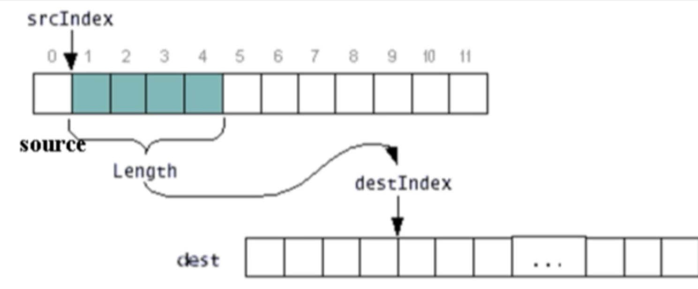

# 1.0 Intro to the Java tutorial at XuetangX
This part is mainly to record all the configuration and basics programming setting about java. Mainly include: 
- What is Java and its history
- JDK and DEV env settings
- Hallo world programs in different IDE
- Basic date type
- Flow Control
- Impression about Object-oriented Programming
- Homework: 3 basic programs to feel what coding really is

## 1.0.0 本章主要内容
- Java与面向对象程序设计简介
- 基本数据类型与表达式
- 数组
- 算法的流程控制

## 1.0.1 JDK的安装与配置01-download
oracle official website install
JDK: java development kit
JRE: java run environment

## 1.0.2 JDK的安装与配置02-install


## 1.0.3 JDK的安装与配置03-env config
environment variable

## 1.0.4 The first program 
```java
public class Helloworld
{
	public static void main(String[] args) {
		System.out.println("Hello World");
	}
}
```
Compile and run
```shell
javac Helloworld.java
java Helloworld
```
### Some file explaination
- Helloworld.java (source file)
- Helloworld.class (字节码)一种可以被解释器理解 并在不同的系统上运行

## 1.0.5 Eclipse IDE
New -> New project -> project name/JavaSE 1.8

- code template for easy use
- modify to suit your work flow


---
---


# 1.1 java与面向对象程序设计简介

- 抽象与封装
- 继承
- 多态

**半编译 半执行**

文字量
标识符：与内存中的某个位置（地址）相对应
变量
常量

关系运算符：
类型比较运算符 *instanceof*

隐含转换：
- 赋值转换（将表达式类型转换为指定变量的类型）
- 方法调用转换（适用于方法或构造方法调用的每一个参数）
- 字符串转换
    - 任何类型（包括null类型）都可以转换为字符串类型
    - 只当一个操作数是String类型时，适用于+运算符的操作数

# 1.3 数组
- 数组时对象（1. 动态初始化 2. 可以复制给Object类型的变量 3. 可以调用Object类的所有方法 4. 每个数组都有一个public final修饰的成员变量： length）
- 数组元素
- 数组的创建和初始化
- 数组引用的声明
- 数组元素的初始化

## 复制数组或数组的部分元素
**Function Template**
```java
public static void arraycopy(Object source, int srcIndex, Object dest, int destIndex, int length)
```


**Example**
```java
public class ArrayCopyDemo
{
	public static void main(String[] args)
	{
		char[] copyFrom = {'d', 'e', 'c', 'a', 'f', 'f', 'e', 'i', 'n', 'a', 't', 'e', 'd'};
		char[] copyTo = new char[7];
		System.arraycopy(copyFrom, 2, copyTo, 0, 7);
		System.out.println(new String(copyTo));
	}
}
```


# 1.4 算法的流程控制
## switch
```java
switch(switch-expression) {
	case value1: statements for case1; break;
	case value2: statements for case1; break;
	...
	case valueN: statements for case1; break;
	default: statements for default case; break;
}

```
Tips:
- switch-expresssion, 常量值value1到valueN必须是整形或字符
- 如果表达式的值和某个case后面的值相同，则从该case之后开始执行，直到break语句为止。
- default是可有可无的，若没有一个常量与表达式的值相同，则从default之后开始执行。

## for+（增强for循环
- 用来对数组或者集合对象进行遍历
- 语法格式（for(Type name:数组或集合类型对象){//循环体；}

## continue
same with C++

# Homework
1. 实现x的n次方，x为类型为double，n的类型为int. 给定输入为x n, 输出x的n次方结果。


```java
import java.util.Scanner;

public class Main
{
	public static void main(String[] args) {
      Scanner scanner = new Scanner(System.in);
      double x = scanner.nextDouble();
      int n = scanner.nextInt();
      double result = x;
      for (int i=0; i<n-1; i++)
      	result *= x;
      System.out.println(result);
	}
}
```
2. 两个整数的哈密顿距离定义为两个数二进制位的个数。给定两个32位整数,M,N，输出M和N的哈密顿距离。输入以空格切分。
```java
import java.util.*;

public class Main {
  public static void main (String[] args) {
    Scanner scanner = new Scanner(System.in);
    int M = scanner.nextInt();
    int N = scanner.nextInt();
    
    System.out.println(getHammingDistance(M, N));
  }
  
  private static int getHammingDistance(int m, int n) {
    int xor = m ^ n;
    int hammingDistance = 0;

    while (xor != 0) {
      if ((xor & 1) == 1) {
        hammingDistance++;
      }
      
      xor >>= 1;
    }
    
    return hammingDistance;
  }
}


```


3. 给定一个长度为N的非负整数数组，现在以数组中的三个数为边长，组成一个三角形，计算能组成三角形的个数。输入为2行，第一行为N，第二行为N个整数，输出为三角形个数。
```java
import java.util.Arrays;
import java.util.Scanner;

public class Main {
    
    public static void main(String[] args) {
        Scanner scanner = new Scanner(System.in);
        int N = scanner.nextInt();
        int[] nums = new int[N];
        for(int i=0; i<N; i++) {
            nums[i] = scanner.nextInt();
        }
        scanner.close();
        
        int res = countTriangles(nums);
        
        System.out.println(res);

    }

    public static int countTriangles(int[] nums) {
        if (nums == null || nums.length <3)
            return 0;
        int count = 0;
        int N = nums.length;
        Arrays.sort(nums);
        for (int i=N-1 ; i>=2 ; i--){
            int left = 0, right = i-1;
            while(left < right){
                if (nums[left] + nums[right] > nums[i]){
                    count += right-left;
                    right--;
                } else {
                    left++;
                }
            }
        }
        return count;
    }
}
```